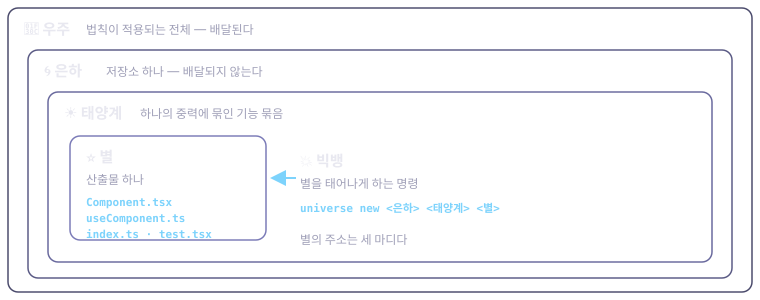
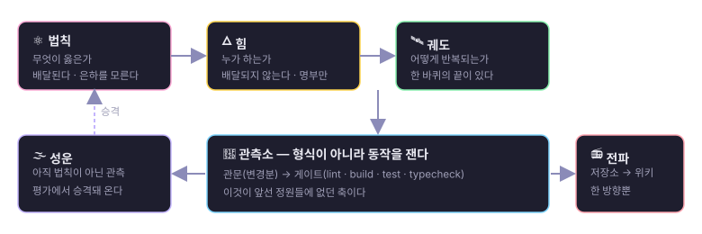

# Universe

> **빅뱅 한 번으로 별이 태어나는 프론트엔드 하네스.**

컴포넌트를 써 주는 도구는 대개 **파일을 뱉고 끝난다.** 이 우주는 자기가 쓴 코드가 **당신 저장소에서 실제로 서는지 기계로 재고**, 못 잰 것은 **못 쟀다고 말한다.** 그리고 안 서면 **되돌린다** — 빨간 주행은 당신 저장소에 흔적을 안 남긴다.

```bash
npm i -D universe-front-harness        # pnpm add -D · yarn add -D 도 같다
./node_modules/.bin/universe init      # <저장소>/universe/ 가 생긴다
./node_modules/.bin/universe           # 인자 없이 치면 고르면서 쓴다
```

⚠️ **깔 때 치는 이름과 쓸 때 치는 이름이 다르다** — 패키지는 `universe-front-harness`, 명령은 `universe` 다. 아래 [함정 하나](#함정-하나--이름이-둘이다)에서 다시 짚는다.

**무엇을 하나** — `universe new <은하> <태양계> <별> --expand` 한 줄이 이 순서로 돈다.

1. **별을 쓴다** — 컴포넌트 · 훅 · index · 행동 계약 테스트가 **한 묶음**으로.
2. **태어날 때 문다** — 당신 저장소가 켠 정적 법칙을 어기면 **태어나지 않는다.**
3. **컴파일한다** — 당신의 빌드 명령으로. 이어서 당신의 lint 를 **그 폴더에만.**
4. **진짜 게이트를 돌린다** — `lint · build · test · typecheck`, 전부 **당신의 명령**으로.
5. **빨간불의 주인을 가린다** — 별 탓인가 저장소 탓인가. 근거를 대고 말한다.
6. **실패하면 되돌린다.**

**모델이 없어도 대부분 돈다.** 별을 낳는 것(1차)도, 게이트까지 돌려 빨간 축을 스스로 고치는 것(2차)도 결정론 규칙과 정적 레인만 쓴다 — 구독도 API 키도 필요 없다. 모델이 필요한 것은 3차(요구사항 한 줄 → 도는 화면)뿐이고, 그것도 누가 답하는지는 사람이 고른다.

**외울 필요도 없다.** 인자 없이 `universe` 를 치면 사람이 치는 명령만 보여 주고, 고른 것에 필요한 것만 묻고, **만들어진 명령줄을 찍고 나서** 실행한다:

```
$ universe new tiny-galaxy shop DashboardToday --expand
이대로 실행할까? [y/N]:
```

다음엔 메뉴를 안 거치게 되는 것이 성공이다 — **화면이 목적이 아니라 입구다.** 그리고 화면은 **관문을 못 끈다.** 「무시하고 계속」 갈래가 없다.

> **훔쳐 갈 만한 생각 하나 — 신호는 두 상태가 아니라 셋이다: 잰 초록 · 잰 빨강 · 그리고 「못 쟀다」.**

셋째를 첫째로 뭉개는 순간 도구는 조용히 거짓말을 한다. 이 저장소가 실제로 밟은 자리들:

- 저장소가 `test` 명령을 선언하지 않았는데 하네스가 기본값을 넣어 돌리고 `✅ test exit 0` 을 찍었다 — **테스트가 하나도 없는 저장소에서.**
- 게이트 하나가 빨개지자 그 뒤 축들이 **화면에서 사라졌다.** 없는 줄은 통과한 줄처럼 읽힌다.
- 환경변수 하나가 없어 `yarn` 이 0.2초 만에 죽었는데 — 아무것도 컴파일하기 전에 — 도구는 **「별이 이 은하에서 서지 않는다」**고 말했다. **재지도 않은 것을 별 탓으로 돌렸다.**

셋 다 고쳤다. 선언 안 됐거나 도달 못 한 축은 `⚪ — 못 쟀다`로 찍히고, 판정은 **잰 축만으로** 계산한다. 이 규율의 전문은 [관측 법칙](laws/observation.md).

## 함정 하나 — 이름이 둘이다

|  | 이름 | 어디서 쓰나 |
|---|---|---|
| **패키지** | `universe-front-harness` | `npm i` · `npm rm -g` · `package.json` |
| **명령** | `universe` | 터미널에서 치는 것 · 이 문서의 모든 `universe X` |

⛔ **`npx universe` 를 치지 마라.** npm 의 `universe` 는 **남의 패키지**다(crossfilter/universe — 데이터셋 탐색 도구). 우리 것은 `npx universe-front-harness` 다 — **한 조각 차이로 남의 것이 온다.**

같은 자리가 되돌릴 때 한 번 더 온다. `npm rm -g` 가 받는 것은 **패키지 이름**이므로 `npm rm -g universe-front-harness` 다 — 명령 이름으로 지우려 하면 아무것도 안 지우거나 **남의 패키지를 건드린다.**

이 경고는 **문서가 스스로 판 함정**이었다(R52): 퀵스타트가 그 이름을 네 번 시켰고, 그대로 따라 하면 엉뚱한 것을 내려받았다. npm 에 올라간 뒤에도 경고는 그대로다 — 그 이름은 여전히 남의 것이고, 바뀐 것은 **우리 이름이 생겼다**는 것 하나뿐이다.

**다섯 층**



| 층 | 디렉터리 | 무엇인가 | 예 |
|----|----------|----------|-----|
| 🌌 **우주** | (저장소 전체) | 법칙이 적용되는 전체 | 이 저장소 |
| 💥 **빅뱅** | `bigbang/` | 별을 태어나게 하는 **명령** | `bigbang new …` |
| 🌀 **은하** | `galaxies/` | 법칙이 적용되는 저장소 하나 | 실측 은하 A |
| ☀️ **태양계** | (은하 안) | 하나의 중력에 묶인 기능 묶음 | 대시보드 |
| ⭐ **별** | (태양계 안) | 산출물 하나 | `DashboardToday` |

**별의 주소**는 세 마디다 — `은하/실측 은하 A · 태양계/dashboard · 별/DashboardToday`.

**나머지 기관**



| 디렉터리 | 역할 |
|----------|------|
| `laws/` | **법칙** — 우주를 지배하는 규칙. 문서가 아니라 **관문**이다 |
| `observatory/` | **관측소** — 별이 도는지 기계가 잰다. 게이트·관문·채점 |
| `nebula/` | **성운** — 아직 별이 아닌 것. 법칙 위반 실측이 여기 쌓이고, 별이 되어 나간다 |
| `log/` | 라운드 기록. 라운드마다 평가와 근거를 남긴다 |

법칙은 읽으라고 있는 것이 아니라 **막으라고** 있다. Blumn Enterprise Harness 의 「정원 헌법」에서 가져온 문장이 그대로 이 우주의 것이다:

> 새 자산 영입 시 체크리스트로 검사하며, **하나라도 실패 시 영입을 보류한다.**

법칙 위반은 관측소가 잡고, 잡히면 별은 태어나지 않는다.

**지금 상태**

<!-- FACTS:BEGIN -->
| 지금 상태 | 값 |
|---|---:|
| 법칙 | 11 |
| 계약 규칙 | 20 |
| ↳ 법칙이 덮은 것 | 20 |
| ↳ 성운이 든 것(주인 없는 규칙) | 0 |
| 등록된 은하 | 2 |
| 관문(`universe check`) | 34 |
| 명령 | 45 |
| ↳ 사람이 치는 것 | 19 |
| ↳ 관문이 알아서 부르는 것 | 26 |
| 판 | 0.9.0 |
<!-- FACTS:END -->

⚠️ 위 블록은 **생성된다**(`universe facts`). 손으로 고치지 마라 — `--check` 가 막는다.

| 단계 | 상태 | 근거 |
|------|------|------|
| P1 우주 뼈대 + 법칙 | ✅ | `laws/` · `universe laws` 관문 |
| P2 관측소 연결 | ✅ | `universe observe` 가 은하를 잰다 |
| P3 빅뱅 1차 팽창 | ✅ | `universe new` — 관문·컴파일·집안 규칙까지 |
| P4 다른 은하로 배달 | ✅ | 진짜 저장소 둘에 깔고 쟀다(단일 앱 1,404파일 · 모노레포 977파일) |
| 2차 팽창(자가 수정) | ✅ | **진짜 은하에서 걸었다**(R146 · 2,027파일 · yarn). 집안 규칙 관문이 별의 lint error 1건을 고쳤고, 게이트가 은하 트렁크 error 11건에 막히자 **「은하 탓」으로 옳게 귀속**하고 자가 수정을 거절했다. 별은 이 은하에서 게이트를 못 지난다 — **은하가 원래 빨갛다**(도구 탓이 아니다) |
| 3차 팽창(요구사항 → 화면) | ✅ | **진짜 은하에서 실주행했다**(R148 · 구독 경로 · 10턴). 에이전트 구현 파일 셋은 **error 0** 이었고, 빨간불 6건은 **우주가 시킨 테스트 파일**에서 났다(브리핑이 은하가 못 하는 일을 시켰다 — 고쳤다). 구독이 없어도 openrouter 레인으로 돈다(R153) |

이 표는 **손으로 적는다** — 「됐다/안 됐다」는 판단이고 기계가 못 짚는다. 대신 **근거 칸을 비워 두지 않는다**: 근거가 없으면 ✅ 를 못 적는다.

**더 읽기**

| | |
|---|---|
| 5분 만에 첫 별 · 매니저별 표 · 망분리 설치 | [docs/01-quick-start.md](docs/01-quick-start.md) |
| 일상 사용법 — 명령 전부 | [docs/02-usage.md](docs/02-usage.md) |
| 심화 — 법칙·스테이지·플러그인을 늘리기 | [docs/03-advanced.md](docs/03-advanced.md) |
| 결과물이 무엇인가 | [docs/04-results.md](docs/04-results.md) |
| **무엇이 되고 무엇이 아직 안 되나** (실측) | [docs/05-expectations.md](docs/05-expectations.md) |
| **구조를 그림으로** — 배달 경계 · 빅뱅 3단계 · 관문과 게이트 | [docs/08-architecture.md](docs/08-architecture.md) |
| 채택 출처 | [docs/06-credits.md](docs/06-credits.md) |
| 배포하는 법(유지보수자) | [docs/10-publishing.md](docs/10-publishing.md) |
| **기여하는 법 · 통과해야 할 관문** | [CONTRIBUTING.md](https://github.com/YuMyeongJun/universe-front-harness/blob/main/CONTRIBUTING.md) |
| English entry | [README.en.md](https://github.com/YuMyeongJun/universe-front-harness/blob/main/README.en.md) |

---

# 뒷이야기 — 왜 이렇게 만들었나

여기부터는 **제품 설명이 아니라 내력**이다. 급하면 안 읽어도 된다.

**왜 정원이 아닌가.** 앞선 하네스들(카카시 하네스 · Blumn Enterprise Harness)은 **정원**이다 — 햇빛·꽃·물길로 천천히 **가꾸는** 은유다. 그래서 talk-bridge 정원은 89일이 걸렸고, SI 정원의 첫 미션은 **11 라운드**가 걸렸다. 이 우주는 **터져 나오는** 은유다 — 하나의 사건(빅뱅)에서 별이 생긴다. **은유가 곧 설계 철학이므로, 정원의 구조를 그대로 옮기지 않는다.** 그리고 두 정원 모두 **형식만 검사하고 동작은 사람이 본다**(lint 는 frontmatter 를 볼 뿐이다). 이 우주에는 **관측소**가 있다 — 별이 실제로 도는지 기계가 잰다. 그것이 이 우주의 존재 이유다.

**「지금 상태」가 여덟 판 동안 낡아 있었다.** 위의 생성 블록은 그냥 편의가 아니다. 실측(R84): 판이 0.9.0 인데 그 자리에는 「v0.1.0 — 뼈대와 법칙 초판만 있다. 아직 빅뱅도 관측소도 붙지 않았다」라고 적혀 있었다. **가장 먼저 읽히는 자리가 가장 낡았다.** 그래서 수치는 손이 아니라 도구가 적는다.

**깔 때 패키지 매니저를 가리지 않는다.** 이 우주는 **의존이 0개**라 `npm` · `pnpm` · `yarn 1` · `yarn berry` 어디서든 깐다 — 사설 레지스트리·스코프·`NODE_AUTH_TOKEN` 설정과 상관이 없다. 넷 다 실측했다. ⚠️ 다만 **그때의 실측은 `npm pack` 한 꾸러미로 한 것이다** — 레지스트리에 올라가기 전이었다. 지금 첫 길은 `npm i -D universe-front-harness` 이고, 레지스트리를 못 쓰는 곳(망분리·사내 미러)에는 그 꾸러미 길이 그대로 남아 있다. 매니저별 표와 **무엇을 쟀고 무엇을 못 쟀는지**는 → [docs/01-quick-start.md](docs/01-quick-start.md)

**우주 자신을 고치는 길.** 위의 설치 두 줄은 **쓰는 사람**의 길이다. 우주 자신을 고치려면 클론해서 잇는다:

```bash
git clone https://github.com/YuMyeongJun/universe-front-harness.git
cd universe-front-harness && npm link      # `universe` 명령을 잇는다
universe                             # 이제 어디서나 `universe`
```

`npm link` 를 안 해도 전부 그대로 쓴다 — `universe X` 를 `node <저장소>/bin/universe.mjs X` 로 바꿔 치면 된다(도구도 이어져 있지 않으면 **그 형태로** 알려 준다). 소비 저장소는 이 길을 쓰지 않는다 — 레지스트리에서 깐다.

**출처** — 이 우주는 무에서 만들지 않았다. **셋에서 채택했다.** 전문은 [docs/06-credits.md](docs/06-credits.md).

| 출처 | 채택한 것 | 바꾼 것 |
|------|-----------|---------|
| **[EnvHarness](https://github.com/google-research/envharness)** (Google Research · Apache 2.0)<br/>*Awakening Static Worlds for Agent Learning* · [arXiv:2608.19880](https://arxiv.org/abs/2608.19880) | **정적 환경을 고치지 않고 밖에서 감싼다**는 발상 · `reset`/`step` 규격 · **Setup·Rule·Link** 3부품 | 에이전트 **학습**이 아니라 **코드 품질**에 쓴다. `evaluate()` 자리에 게이트와 정적 규칙이 들어온다 |
| **[Toss Frontend Fundamentals](https://frontend-fundamentals.com/)**<br/>*변경하기 쉬운 프론트엔드 코드를 위한 지침서* | 물질 법칙 넷의 축 — 네이밍 · 평탄성 · 응집 · 파생 state | **읽는 지침서를 무는 관문으로.** 그 과정에서 오탐이 생기므로 「법칙이 헛돌면 뺀다」를 추가했다 |
| **[카카시 하네스](https://github.com/psmon/harness-kakashi)** (MIT) | 3층 구조 · 배포판=씨앗+절차 · 평가 필수/합성 등급 금지 · **「로그에만 남은 제안은 실행되지 않는다」** | 은유(가꾸는 정원 → 터져 나오는 우주) · **검사의 깊이**(형식 → 동작) · **법칙은 배달한다** |

**세 곳 모두 코드 복사가 아니라 설계 채택이다.** 관측 엔진은 자체 구현이다. EnvHarness 의 3부품은 우주에서 이렇게 대응한다:

| EnvHarness | 우주 |
|---|---|
| **Setup** — 초기 상태를 재구성 | 스테이지의 결함 주입 |
| **Rule** — 상호작용을 재구성 | **관문(Contract)** — 쓰기가 파일에 닿기 전에 가로챈다 |
| **Link** — 다른 환경의 과제를 조합 | 은하 · 태양계 |

**라이선스** — MIT, [LICENSE](LICENSE).
