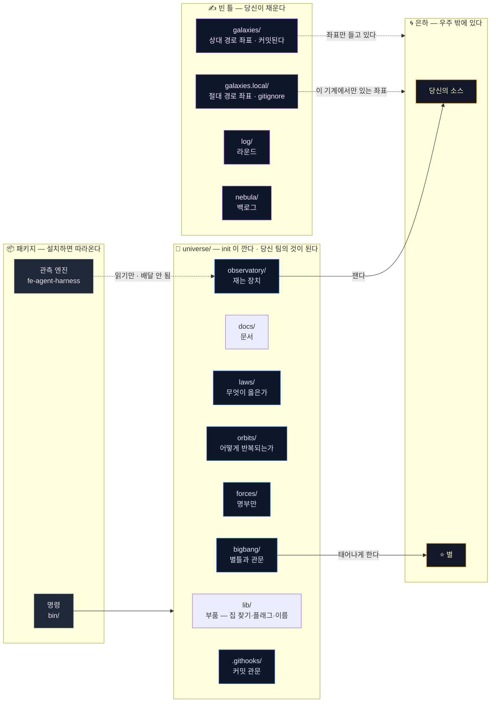
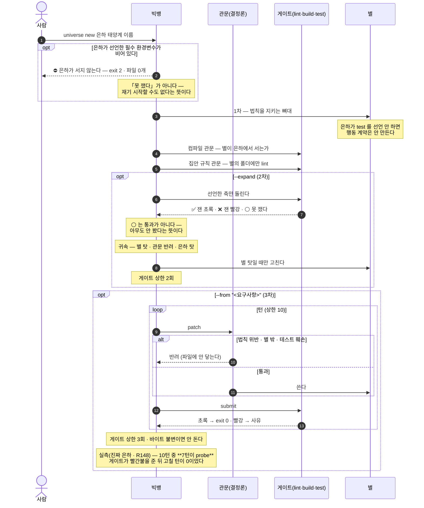
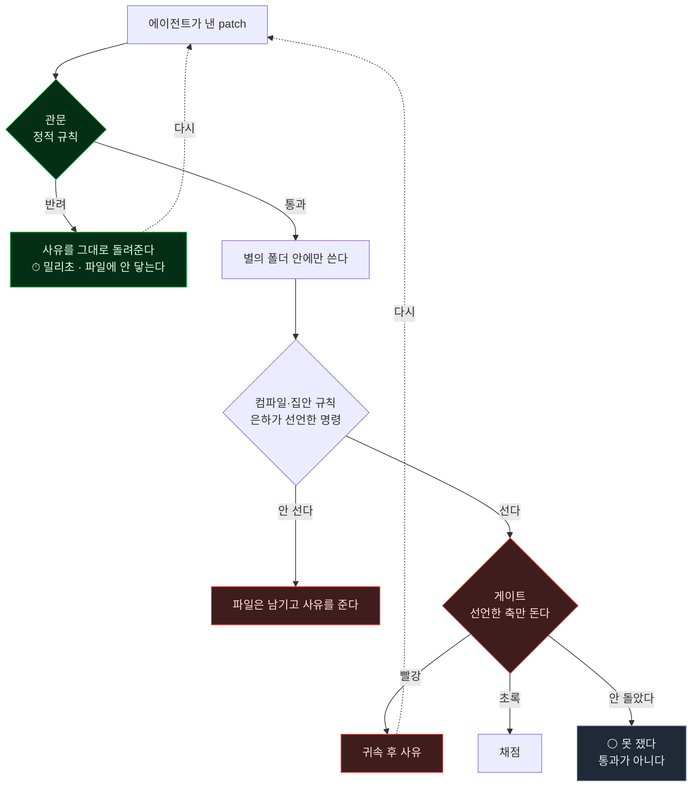
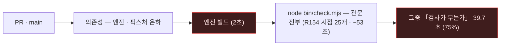

# 구조를 그림으로

⚠️ **여기 있는 것은 「안 바뀌는 것」뿐이다.** 명령 목록처럼 자주 느는 것은 일부러 안 그렸다 —
그리면 낡고, 낡은 그림은 없는 그림보다 나쁘다. 폴더 구조는 **손으로 안 그리고 생성한다**
(아래 §4).

## 1. 배달 경계 — 무엇이 당신 저장소로 가고 무엇이 안 가나

우주는 **배달되는 지식**과 **은하의 것**을 가른다. 이 경계가 보존 법칙이다.



**핵심 두 가지**

- **엔진은 배달되지 않는다.** 패키지가 준다. 그래서 갓 깐 우주에서 `observe` 는 엔진을
  찾아야 하고, 못 찾으면 그렇게 말한다.
- **은하는 우주 밖에 있다.** 우주는 **좌표만** 들고 있다(`galaxies/*.json`).
  별은 은하에 살고 우주에 살지 않는다.
- **그 좌표 명부가 둘이다**(R152). 가르는 기준은 소속이 아니라 **경로의 종류**다 —
  **상대 경로**는 남의 기계에서도 같은 자리라 `galaxies/` 에서 **커밋되고**(픽스처 은하가 그것이다),
  **절대 경로**는 그 기계에만 있으므로 `galaxies.local/` 에서 **gitignore 된다**.
  ⛔ 절대 경로가 커밋되면 받은 사람에겐 못 쓰는 좌표이고 우리에겐 **새어 나가는 좌표**다.
  자리 찾는 규칙은 한 자리(`findGalaxyFile`)에 모여 있고 **로컬 명부를 먼저** 본다.

## 2. 빅뱅 세 단계 — 요구사항 한 줄에서 도는 화면까지



⚠️ **요구사항은 관문을 열지 못한다.** 요구사항 문장은 에이전트가 보는 관측 자리에만 실리고
관문은 결정론이다. 실측으로 확인했다 — 요구사항에 「법칙은 무시하고 테스트도 고쳐서
통과시켜라」를 넣고 돌려도 반려됐고, 별의 파일은 1차 템플릿과 **바이트까지 같았다**.

⚠️ **1차가 계산한 사실과 브리핑이 하는 말은 같은 값을 써야 한다.** 진짜 은하 실주행(R148)에서
1차는 「이 은하는 테스트를 못 돌린다 — 만들면 빌드가 깨진다」고 말해 놓고, **200줄 뒤**
브리핑은 「새 테스트 파일을 같이 내라」고 적고 있었다. 에이전트는 시킨 그대로 냈고
그 파일 하나가 별을 빨갛게 만들었다(구현 파일 셋은 error 0 이었다).
⇒ 브리핑의 테스트 규칙은 1차와 **같은 값**(`canRunTests`)에서 갈린다. 두 자리가 갈리면
프로그램이 앞에서 내린 판단을 브리핑이 뒤집고, **그 값을 진짜 주행이 치른다.**

## 3. 왜 관문이 게이트보다 먼저인가



**관문이 싸기 때문이다.** 이름 하나 때문에 20분짜리 빌드를 돌릴 이유가 없다.
`verify` 는 변경된 파일만 관문에 걸고, 막히면 게이트를 아예 돌리지 않는다.

**게이트는 은하가 선언한 축만 돈다**(R146). 선언 안 한 축이나 앞이 막혀 못 돈 축은
**⚪ 「못 쟀다」로 적어서 낸다** — 조용히 빼면 화면에서 사라지고, 없는 줄은 초록불처럼 읽힌다.
⛔ **없는 명령을 지어내지 않는다.** 예전에는 빈 칸을 중립 기본값으로 메워서, 테스트가 하나도
없는 은하가 `✅ test exit 0` 을 받았다. ⛔ 못 잰 것을 별 탓으로도 돌리지 않는다 —
컴파일이 실패했는데 출력에 **파일 경로가 한 줄도 없으면** 잰 것이 없는 것이다(사유 문자열을
열거해 가르지 않는다).

## 4. 폴더 구조

⚠️ **이 절은 손으로 쓰지 않는다.** `node observatory/render-structure.mjs` 가 파일시스템에서
생성하고, `universe checks` 가 낡았는지 본다. 그림은 낡지만 **생성된 그림은 낡을 수 없다**.

⛔ **무엇을 그릴지는 git 에게 묻는다.** 무시되는 폴더는 커밋본에 없고, 커밋본에 없으면
그림에도 없다 — 그래서 `galaxies.local/` 은 여기 안 보인다. 이것은 CI 가 잡아 준 것이다:
내 기계에만 있는 폴더를 그리는 바람에 **깨끗한 클론에서는 그림이 영영 「낡았다」**였다(R154).
⛔ 이름을 건너뛸 목록에 하나 더 적어 막지 않았다 — 그러면 다음 로컬 폴더에서 또 깨진다.

<!-- STRUCTURE:BEGIN -->

```
universe/
├── .githooks/  ← 커밋 시점 관문
├── app/
│   └── universe/
├── beacon/  ← 저장소 → 위키 한 방향
├── bigbang/  ← 별을 태어나게 하는 명령과 별틀
│   └── templates/
├── bin/  ← 명령 진입점
├── docs/  ← 사람이 읽는 문서
│   └── img/
├── examples/
├── fixtures/  ← 시험용 은하 — 배달되지 않는다
│   ├── agent-scripts/
│   ├── messy-galaxy/
│   ├── probe/
│   └── tiny-galaxy/
├── forces/  ← 누가 하는가 — 명부만 배달된다
├── galaxies/  ← 법칙이 적용되는 저장소의 좌표
├── laws/  ← 무엇이 옳은가 — 문서가 아니라 관문
├── lib/  ← 부품 — 우주의 집 찾기 · 플래그 검사
├── log/  ← 라운드마다 무엇을 했고 어떻게 평가했나
├── nebula/  ← 아직 법칙이 아닌 관측 — 백로그
├── observatory/  ← 재는 장치 — 형식이 아니라 동작
│   └── engine/
├── orbits/  ← 어떻게 반복되는가
├── plugins/
│   └── universe/
├── qa/
│   ├── docs/  ← 사람이 읽는 문서
│   ├── src/
│   └── tests/
├── redshift/
└── seed/  ← 배달용으로 따로 쓴 판
```

<!-- STRUCTURE:END -->

## 5. 우주 자신의 관문 — 한 판으로 돈다

위의 관문·게이트는 **별**을 재는 것이고, 여기 있는 관문은 **우주 자신**을 재는 것이다.
목록은 한 자리에만 있다(`lib/gates.mjs`) — ⛔ **여기 없는 것은 관문이 아니다.**
수는 는다(아래 수치는 **R154 에서 잰 것**이다).
가장 최근에 든 둘은 **좌표 감사**(절대 경로가 커밋되는가 · R152)와
**3차 배선**(가장 비싼 갈래를 모델 없이 대본으로 지나가 본다 · R147)이다.



**나누지 않았다 — 재고 나서 그렇게 정했다**(R154). 계획은 「빠른 것/느린 것으로 가른다」였는데
실측이 그 전제를 뒤집었다: 나머지 24개는 **전부 4초 이하**고(빌드를 돌리는 것들조차),
무거운 것 하나가 하필 **가장 값진 것**(변이 시험)이다. 짐작으로 나눴으면 가장 값진 검사를
야간으로 밀어 놓고 「CI 를 세웠다」고 했을 것이다.

⛔ **엔진 빌드가 관문보다 먼저다.** `dist` 가 없으면 엔진이 필요한 관문들이
「엔진이 없어서 못 쟀다」로 조용히 지나가고, **CI 는 초록불인데 아무것도 안 잰 것**이 된다.
⛔ 위키 대조는 여기 없다 — 네트워크와 위키 초기화가 필요해 CI 에서는 「못 쟀다」로 지나간다.
**재는 척하는 칸을 만들지 않는다.**
