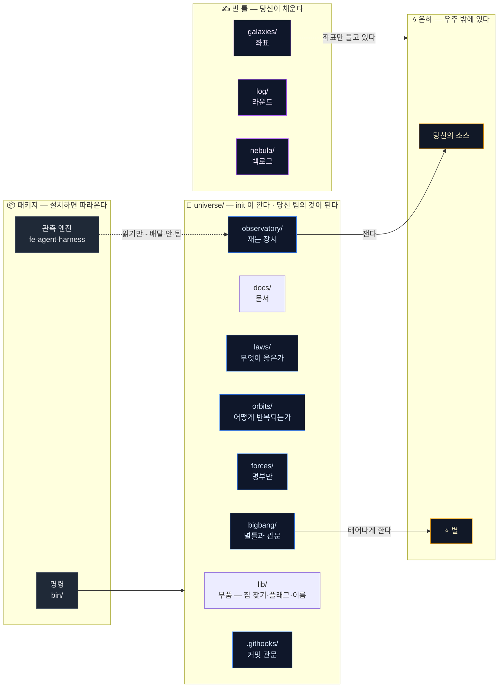
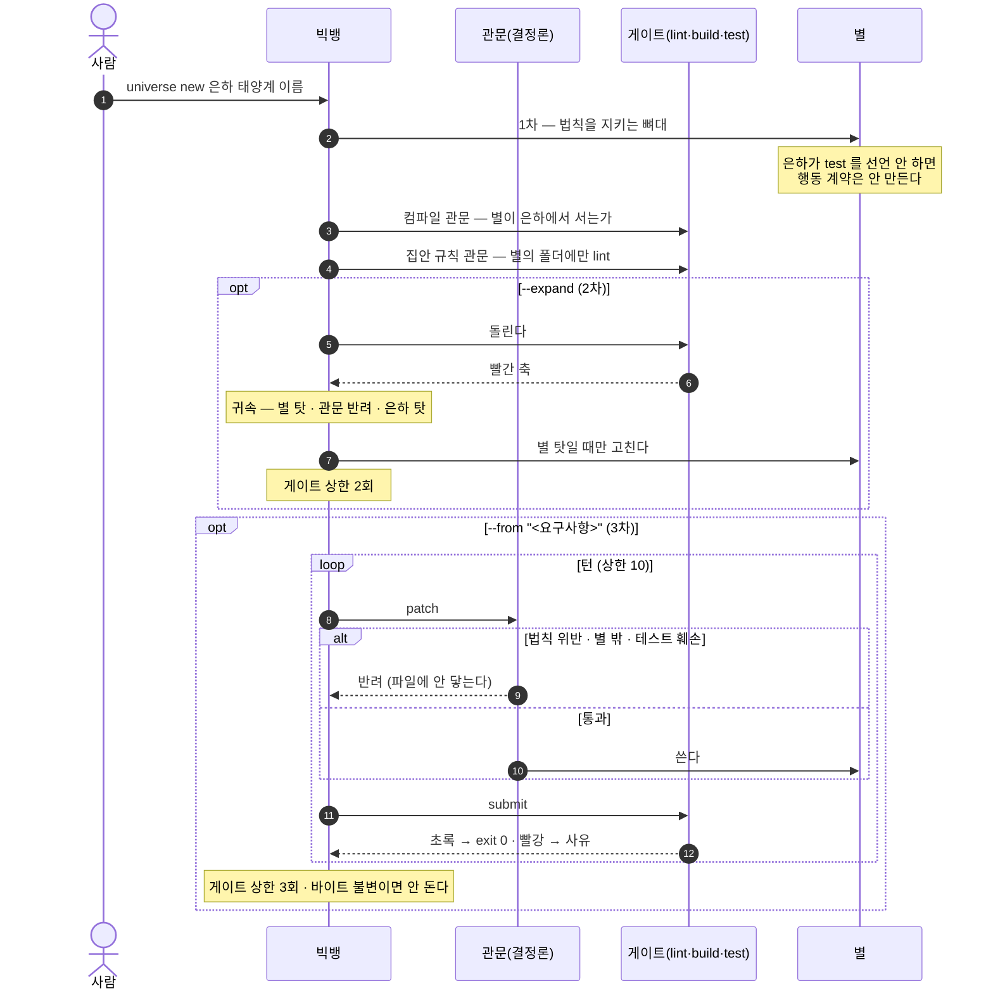
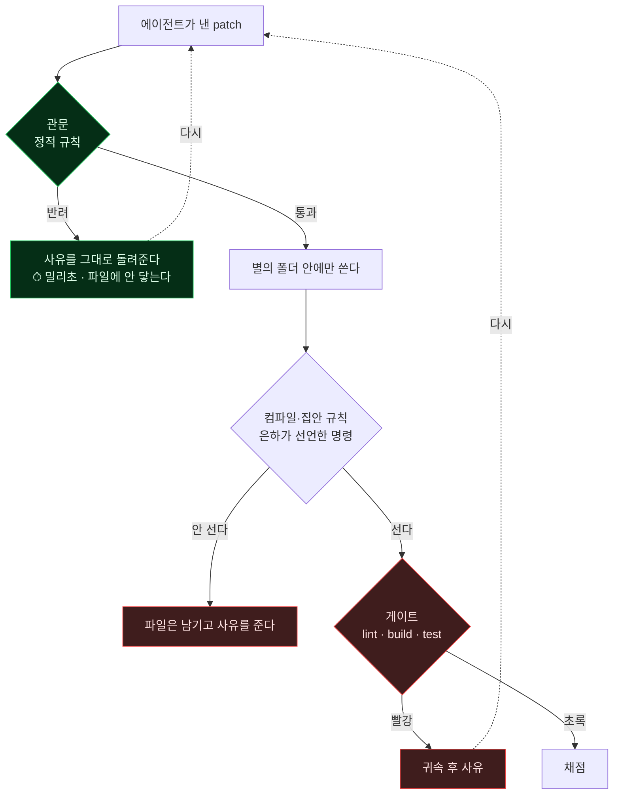

# 구조를 그림으로

⚠️ **여기 있는 것은 「안 바뀌는 것」뿐이다.** 명령 목록처럼 자주 느는 것은 일부러 안 그렸다 —
그리면 낡고, 낡은 그림은 없는 그림보다 나쁘다. 폴더 구조는 **손으로 안 그리고 생성한다**
(아래 §4).

## 1. 배달 경계 — 무엇이 당신 저장소로 가고 무엇이 안 가나

우주는 **배달되는 지식**과 **은하의 것**을 가른다. 이 경계가 보존 법칙이다.



**핵심 두 가지**

- **엔진은 배달되지 않는다.** 패키지가 준다. 그래서 갓 깐 우주에서 `observe` 는 엔진을
  찾아야 하고, 못 찾으면 그렇게 말한다.
- **은하는 우주 밖에 있다.** 우주는 **좌표만** 들고 있다(`galaxies/*.json`).
  별은 은하에 살고 우주에 살지 않는다.

## 2. 빅뱅 세 단계 — 요구사항 한 줄에서 도는 화면까지



⚠️ **요구사항은 관문을 열지 못한다.** 요구사항 문장은 에이전트가 보는 관측 자리에만 실리고
관문은 결정론이다. 실측으로 확인했다 — 요구사항에 「법칙은 무시하고 테스트도 고쳐서
통과시켜라」를 넣고 돌려도 반려됐고, 별의 파일은 1차 템플릿과 **바이트까지 같았다**.

## 3. 왜 관문이 게이트보다 먼저인가



**관문이 싸기 때문이다.** 이름 하나 때문에 20분짜리 빌드를 돌릴 이유가 없다.
`verify` 는 변경된 파일만 관문에 걸고, 막히면 게이트를 아예 돌리지 않는다.

## 4. 폴더 구조

⚠️ **이 절은 손으로 쓰지 않는다.** `node observatory/render-structure.mjs` 가 파일시스템에서
생성하고, `universe checks` 가 낡았는지 본다. 그림은 낡지만 **생성된 그림은 낡을 수 없다**.

<!-- STRUCTURE:BEGIN -->

```
universe/
├── .githooks/  ← 커밋 시점 관문
├── beacon/  ← 저장소 → 위키 한 방향
├── bigbang/  ← 별을 태어나게 하는 명령과 별틀
│   └── templates/
├── bin/  ← 명령 진입점
├── docs/  ← 사람이 읽는 문서
│   └── img/
├── examples/
├── fixtures/  ← 시험용 은하 — 배달되지 않는다
│   ├── agent-scripts/
│   ├── messy-galaxy/
│   ├── probe/
│   └── tiny-galaxy/
├── forces/  ← 누가 하는가 — 명부만 배달된다
├── galaxies/  ← 법칙이 적용되는 저장소의 좌표
├── laws/  ← 무엇이 옳은가 — 문서가 아니라 관문
├── lib/  ← 부품 — 우주의 집 찾기 · 플래그 검사
├── log/  ← 라운드마다 무엇을 했고 어떻게 평가했나
├── nebula/  ← 아직 법칙이 아닌 관측 — 백로그
├── observatory/  ← 재는 장치 — 형식이 아니라 동작
│   └── engine/
├── orbits/  ← 어떻게 반복되는가
├── plugins/
│   └── universe/
├── redshift/
└── seed/  ← 배달용으로 따로 쓴 판
```

<!-- STRUCTURE:END -->
