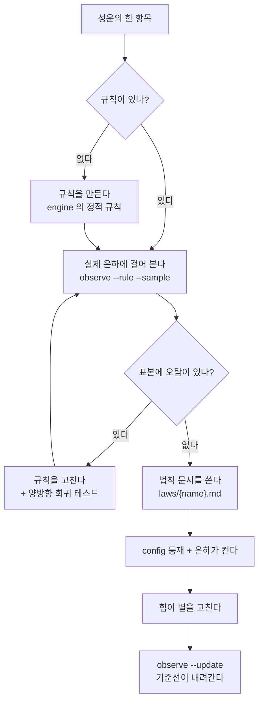

# 성운 → 법칙 → 별 궤도

> 성운은 **재료**다. 법칙이 되어야 집행되고, 별에 닿아야 값이 준다.

## 흐름

## 단계

1. **성운에서 하나를 꺼낸다.** 「왜 아직 법칙이 아닌가」에 적힌 것이 이번 라운드의 일이다.
2. **규칙이 없으면 만든다.** 엔진의 정적 규칙(`observatory/engine`)에 넣는다.
3. **실제 은하에 걸어 본다** — `observe.mjs --rule <id> --sample 20`.
   ⚠️ **표본을 눈으로 보고 오탐을 세라.** 작은 표본의 오탐 0 은 아무것도 보장하지 않는다 —
   이 우주의 재료가 된 규칙들도 1,227개 파일에 걸고 나서야 오탐 4종·153건이 드러났다.
4. **오탐이 있으면 규칙을 고치고 양방향 회귀를 박는다** — 잡아야 할 것을 잡는가 + 잡으면 안 되는 것을 안 잡는가.
   고치기 어려우면 **법칙으로 만들지 말고 성운에 남긴다.** 헛도는 관문이 더 나쁘다.
5. **법칙 문서를 쓴다** — 규칙 · 왜 · 재는 법 · 위반 시. 「재는 법」이 없으면 법칙이 아니다.
6. **은하가 켠다** — `galaxies/{n}.json` 의 `laws` 에 넣는다. 합의가 필요한 것은 `optIn` 으로.
7. **힘이 별을 고친다** → `observe.mjs --update` 로 기준선이 내려간다.

## 한 바퀴의 끝

**은하의 기준선이 실제로 내려갔을 때.** 법칙만 만들고 끝나면 절반이다.

## 0건은 무죄가 아니다

성운의 항목이 은하에서 0건이면 **위반이 없는 것인지 탐지가 약한 것인지** 먼저 가른다.
못 가르면 성운에 그렇게 적는다 — 「0건이라 통과」로 적는 것이 관측 법칙 위반이다.
