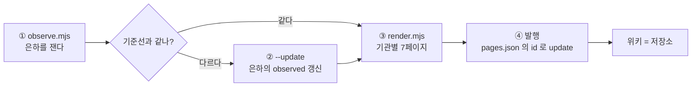

# 관측→전파 궤도 (Observe → Broadcast)

> **낡은 수치를 발행하는 것은 안 하느니만 못하다.**

## 흐름

## 단계

1. **`node observatory/observe.mjs`** — 은하마다 법칙별 위반 수를 잰다.
   기준선(`galaxies/{n}.json` 의 `observed.laws`)과 다르면 `exit 1`.
2. **`--update`** — 실측을 기준선으로 심는다. ⚠️ **차이가 왜 났는지 먼저 보라.**
   코드가 좋아진 것인지, 규칙이 바뀐 것인지, 대상이 달라진 것인지.
   모르면 로그에 「원인 미규명」으로 적는다(추정으로 덮지 않는다).
3. **`node beacon/render.mjs`** — 우주 상태를 읽어 7페이지로 조립한다.
   렌더러는 사실을 쓰지 않는다 — 파일에서 읽는다.
4. **발행** — `beacon/pages.json` 의 페이지 id 로 **update**. create 하면 중복이 쌓인다.

## 한 바퀴의 끝

**위키의 수치가 저장소의 기준선과 같을 때.**

## ⛔ 지키는 것

- **발행 전에 `observe.mjs` 가 초록불이어야 한다.**
- **방향은 한쪽뿐이다** — 위키에서 저장소로 읽어 오지 않는다(보존 법칙).
- 발행은 아직 사람이 부른다(자동화 **C** · 성운에 올라가 있다).
