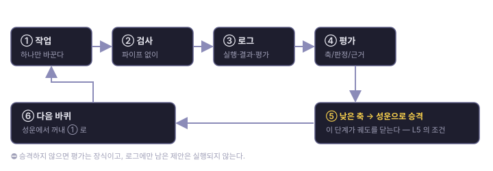
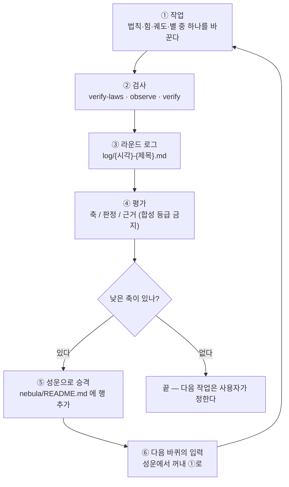

# 라운드 궤도 (Round)

> 평가는 점수를 매기려고 하는 것이 아니다. **다음 바퀴를 정하려고** 하는 것이다.

## 흐름

## 단계

1. **작업** — 한 라운드에 하나. 원인 하나에 수정 하나.
2. **검사** — `verify-laws.sh` → `observe.mjs` → (코드를 만졌으면) `verify.mjs`.
   **검사 출력을 grep 으로 걸러 보지 마라** — 크래시를 놓친다(R04 에서 실제로 놓쳤다).
3. **라운드 로그** — `log/{yyyy-MM-dd-HH-mm}-{title}.md`. 필수 절: 실행 요약 · 결과 · 평가 · 다음 단계.
4. **평가** — 관측자의 3축(집행 가능성 / 실측 기반성 / 변경 정직성) + 필요하면 그 라운드 전용 축.
   - **합성 등급 금지** — "종합 B+" 로 합치지 않는다.
   - **근거 없는 등급은 무효** — 어느 기준의 어느 항목인지 적는다.
   - **판정 낱말은 도구가 아는 것만** — `통과`·`미흡`(또는 `A`~`F`).
     ⚠️ 실측: R35 부터 사람이 `A` 대신 `통과` 를 쓰기 시작했는데 도구가 그 말을 몰라
     **최고 판정 12건을 전부 성운으로 승격**시켰다. 성운 페이지가 14KB 로 크기 한계를
     넘고서야 드러났다. 이제 `close` 와 `audit` 둘 다 **모르는 낱말을 거부한다**(§7).
     어휘를 늘리려면 `bin/round.mjs` 의 `VERDICTS` 에 적어라.
5. **⭐ 낮은 축을 성운으로 승격** — 이 단계가 궤도를 닫는다.
   - A 가 아닌 축마다 **성운에 한 행**을 만든다: 무엇을 봤나 · 실측(또는 `미측정`) · 왜 아직 법칙이 아닌가.
   - 승격하지 않기로 했으면 **로그에 그 이유를 적는다.** 그냥 두는 것은 안 된다.
6. **다음 바퀴** — 성운에서 하나를 꺼내 ①로 간다.

## 한 바퀴의 끝

**성운에 항목이 올라갔거나, 안 올린 이유가 로그에 적혔을 때.**
그 전까지 라운드는 끝나지 않았다.

## 왜 이것이 L5 의 조건인가

성숙도 L5 는 「자기 개선 루프 — 낮은 평가가 다음 라운드의 작업이 된다」다.
평가만 하고 승격하지 않으면 **평가는 장식이고 우주는 L4 에 묶인다.**
R01~R03 이 정확히 그 상태였다.

## 미승격의 대가 — 실측

| 라운드 | 낮은 축 | 그때 어떻게 됐나 |
|--------|---------|-----------------|
| R01 | 은유 정합성 **B**(이름 확인 못 받음) | 로그에만. 두 라운드 뒤 사용자가 직접 지적해서야 다뤄졌다 |
| R03 | 자동화 완결성 **C**(헤드리스 발행 없음) | 로그에만. 여전히 사람이 부른다 |
| R02 | 변경 정직성 High 이나 **원인 미규명** | 로그에만. 다음 라운드에서 잊혔다 |

**세 건 다 로그에만 남았다.** 그래서 이 궤도를 낸다.
